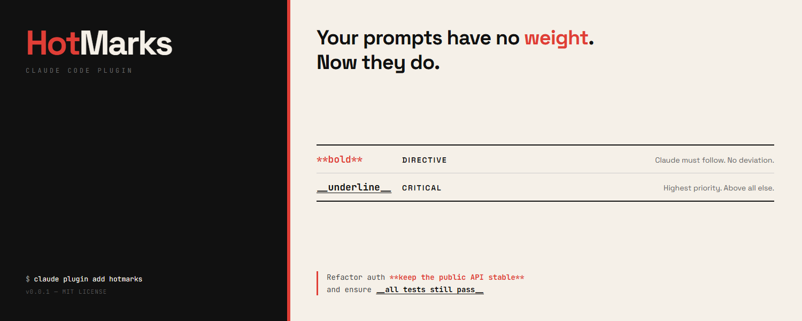

# HotMarks

**Give your prompts weight.** Semantic formatting plugin for Claude Code.



---

## What is HotMarks?

When you talk to Claude Code, every word in your prompt is treated equally. A casual remark and a critical rule carry the same weight. HotMarks changes that.

With HotMarks, you can mark specific parts of your prompt as:

| What you type | What it means | What Claude does |
|---------------|---------------|------------------|
| `**do not delete the database**` | **Directive** — a hard rule | Claude treats this as non-negotiable. No exceptions. |
| `__make sure tests pass__` | **Critical** — top priority | Claude prioritizes this above everything else. |

Everything else in your prompt stays normal priority.

### Example

You type this in Claude Code:

```
Refactor the auth module **do not change the public API** and __ensure all tests pass__
```

HotMarks automatically tells Claude:
- "do not change the public API" is a **hard rule** — follow it exactly
- "ensure all tests pass" is **critically important** — prioritize it

No extra steps. No setup menus. Just type your markers and submit.

---

## Install

### Step 1: Add the plugin

Open Claude Code and run:

```bash
claude plugin add hotmarks
```

### Step 2: Create your config (optional)

```bash
npx hotmarks setup
```

This creates a `.hotmarks` file in your project folder. You can skip this — HotMarks works with sensible defaults out of the box.

**That's it.** HotMarks is now active on every prompt you submit.

---

## How to Use

### Marking a directive (hard rule)

Wrap text in double asterisks — `**like this**`:

```
Build the payment API **never log credit card numbers**
```

Claude will treat "never log credit card numbers" as an absolute constraint it cannot violate.

### Marking critical emphasis (top priority)

Wrap text in double underscores — `__like this__`:

```
Fix the login bug __this is blocking production__
```

Claude will treat "this is blocking production" as the highest-priority concern.

### Using both together

```
Migrate the database **do not drop any tables** and __zero downtime required__
```

Claude knows:
- "do not drop any tables" → hard rule, must obey
- "zero downtime required" → most important concern

### What about code blocks?

HotMarks is smart — it ignores markers inside code blocks. So this:

````
Show me how to use `**bold**` in markdown
````

won't trigger a directive. Only markers in your regular prompt text are detected.

---

## Configuration

HotMarks works without any configuration. If you want to customize behavior, edit the `.hotmarks` file in your project root:

```json
{
  "mode": "reminder",
  "skipCodeBlocks": true
}
```

### Modes

| Mode | What it does |
|------|-------------|
| `reminder` | Adds context explaining your markers to Claude (default) |
| `transform` | Replaces markers with explicit tags like `[DIRECTIVE: ...]` |
| `both` | Does both |

### Where HotMarks looks for config

1. `.hotmarks` in your current project folder
2. `.hotmarks` in your home directory (`~/.hotmarks`)
3. Built-in defaults (if no file found)

---

## Update

To update HotMarks to the latest version:

```bash
claude plugin remove hotmarks
claude plugin add hotmarks
```

---

## Uninstall

### Remove the plugin

```bash
claude plugin remove hotmarks
```

### Remove the config file (optional)

```bash
npx hotmarks uninstall
```

Or just delete the `.hotmarks` file from your project folder manually.

---

## How It Works (Technical)

1. You type `**text**` or `__text__` in your prompt
2. On submit, the `UserPromptSubmit` hook fires
3. HotMarks parses your prompt for markers (skipping code blocks)
4. Based on your config mode, it injects semantic context via `additionalContext`
5. Claude receives structured priority information alongside your prompt

The plugin runs entirely locally. No data is sent anywhere. No network requests.

---

## Development

```bash
npm install       # install dependencies
npm run build     # compile TypeScript
npm test          # run all 31 tests
```

### Run locally

```bash
claude --plugin-dir .
```

---

## Requirements

- Node.js 18 or newer
- Claude Code CLI
- Zero runtime dependencies

---

## Star History

<a href="https://www.star-history.com/?repos=AdhamHossamm%2FHotMarks-forClaudeCode&type=date&legend=top-left">
 <picture>
   <source media="(prefers-color-scheme: dark)" srcset="https://api.star-history.com/chart?repos=AdhamHossamm/HotMarks-forClaudeCode&type=date&theme=dark&legend=top-left" />
   <source media="(prefers-color-scheme: light)" srcset="https://api.star-history.com/chart?repos=AdhamHossamm/HotMarks-forClaudeCode&type=date&legend=top-left" />
   
 </picture>
</a>

---

## Contributing

See [CONTRIBUTING.md](CONTRIBUTING.md) for guidelines.

## Security

See [SECURITY.md](SECURITY.md) for reporting vulnerabilities.

## License

[MIT](LICENSE) — see [DISCLAIMER.md](DISCLAIMER.md) for full terms of use.

---

**Built by [Tawaar Technologies](https://github.com/TawaarTech) with Claude Code**
